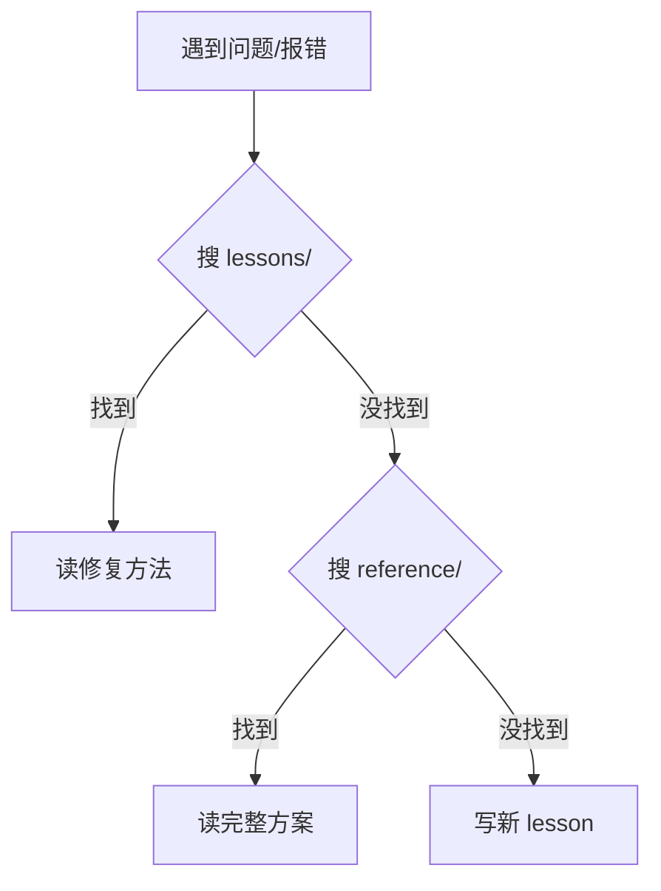

# 检索与贡献指南

## 遇到问题时的检索顺序



### 步骤详解

1. **快速搜所有**
   ```bash
   python3 search_knowledge.py "你的关键词"
   ```

2. **只看 lessons（踩坑记录）**
   ```bash
   python3 search_knowledge.py "关键词" --lessons
   ```

3. **只看 reference（完整方案）**
   ```bash
   python3 search_knowledge.py "关键词" --ref
   ```

4. **只看标题（快速定位）**
   ```bash
   python3 search_knowledge.py "关键词" --titles
   ```

### lessons 和 reference 的区别

| | lessons/ | reference/ |
|---|---|---|
| 内容 | 踩坑记录：问题→根因→修复→验证 | 完整方案：需求→规划→代码→上下文 |
| 长度 | 几百字 | 几千字 |
| 适合 | "坏了怎么修" | "怎么做一整套" |
| 从 lessons → reference | frontmatter 的 `reference:` 字段 | — |

## 贡献新知识

### 踩坑记录（推荐）

```bash
python3 scripts/queue_lesson.py \
  -t "你的标题" -d domain \
  --tags "node:你的节点名,project:项目名" \
  "问题描述\n\n## 根因\n...\n\n## 修复\n...\n\n## 验证\n..."
```

### 简单方式

```bash
python3 misakanet/scripts/bulk_import_lessons.py wizard 你的节点名
```

## 贡献流程

1. **每次有价值的对话结束时**，自问"有什么值得跨节点共享？"
2. **如果有**，运行 queue_lesson.py 入库
3. **使用正确的 domain 和 tags**：
   - domain: rag, devops, feishu, fanuc, etc.
   - tags: node:节点名, project:项目名, severity:级别

## 知识库结构

```
lessons/          # 踩坑记录（几百字）
reference/        # 完整方案（几千字）
```

每个 lesson 应该包含：
- 问题描述
- 根因分析
- 修复方法
- 验证步骤
