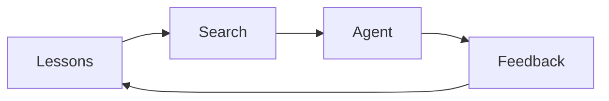
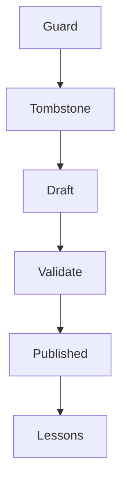

# MisakaNet Architecture

## Core Flywheel

## Draft Pipeline

## Key Flow

1. **Agent** encounters error → **Search** for lessons
2. **Apply** lesson → report outcome
3. If failure → create **Draft** lesson
4. **Guard** validates → **Publish** to lessons
5. Loop continues
